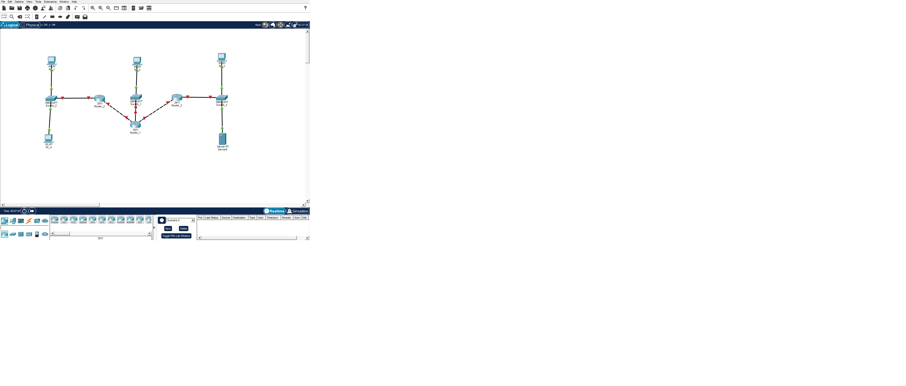
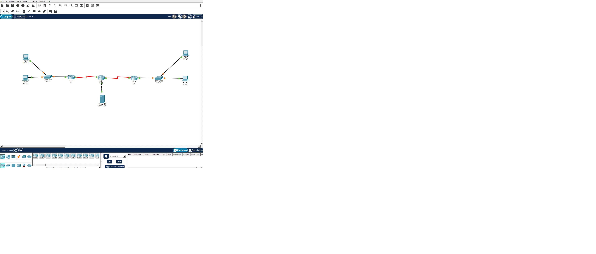

# IPv6 Lab — 3 Routers, Dual Serial Links

## Opis

Własne ćwiczenie adresacji IPv6, wykonane poza kursem CCNA, w oparciu
o zdobytą wiedzę z VLSM i adresacji IPv6.

## Topologia



- 3 routery (Router_1, Router_2, Router_3)
- Router_1 połączony łączem Serial z Router_2 oraz Router_3
- Każdy router ma własną sieć LAN (switch + komputery)

## Adresacja IPv6

Prefiks bazowy: `2001:db8:acad::/48`

| Segment                      | Podsieć              |
| ---------------------------- | -------------------- |
| Router_1 ↔ Router_2 (Serial) | 2001:db8:acad:4::/64 |
| Router_1 ↔ Router_3 (Serial) | 2001:db8:acad:5::/64 |
| LAN przy Router_2            | 2001:db8:acad:1::/64 |
| LAN przy Router_3            | 2001:db8:acad:3::/64 |

## Status

- [x] Połączenia Serial skonfigurowane i przetestowane (ping OK)
- [ ] Adresacja sieci LAN
- [ ] Routing między podsieciami

---

# DNS Lab — Basic DNS Resolution

## Opis

Proste ćwiczenie konfiguracji DNS w Cisco Packet Tracer, wykonane
na podstawie wiedzy z kursu CCNA.

Celem ćwiczenia jest skonfigurowanie serwera DNS, dodanie rekordów DNS
oraz sprawdzenie rozwiązywania nazw z poziomu komputera i routera.

## Topologia


- 1 router (R1)
- 1 switch (SW1)
- 1 komputer (PC1)
- 1 serwer pełniący funkcję DNS Server

## Adresacja IPv4

Sieć: `192.168.10.0/24`

| Urządzenie | Interfejs / rola | Adres IP       |
| ---------- | ---------------- | -------------- |
| R1         | Gateway          | 192.168.10.1   |
| PC1        | Host             | 192.168.10.10  |
| Server     | DNS Server       | 192.168.10.100 |

### DNS Records

| Nazwa              | Adres IP       |
| ------------------ | -------------- |
| `www.lab.local`    | 192.168.10.100 |
| `router.lab.local` | 192.168.10.1   |

## Konfiguracja DNS

Na serwerze włączono usługę DNS i skonfigurowano rekordy:

- `www.lab.local` → `192.168.10.100`
- `router.lab.local` → `192.168.10.1`

Na PC1 skonfigurowano adres DNS Server:

`192.168.10.100`

Na R1 skonfigurowano korzystanie z serwera DNS:

```cisco
ip name-server 192.168.10.100
ip domain-name lab.local
```

## Testy

Rozwiązywanie nazw zostało przetestowane z poziomu PC1:

```text
ping www.lab.local
ping router.lab.local
```

Test `router.lab.local` zakończył się poprawnie:

```text
Pinging 192.168.10.1 with 32 bytes of data:

Reply from 192.168.10.1: bytes=32 time<1ms TTL=255
Reply from 192.168.10.1: bytes=32 time=1ms TTL=255
Reply from 192.168.10.1: bytes=32 time=1ms TTL=255
Reply from 192.168.10.1: bytes=32 time<1ms TTL=255
```

# VLAN & Inter-VLAN Routing Lab

## Opis

Ćwiczenie konfiguracji VLAN, trunkingu oraz routingu między VLAN-ami
w Cisco Packet Tracer, wykonane na podstawie wiedzy z kursu CCNA.

Celem ćwiczenia było skonfigurowanie dwóch VLAN-ów, połączenia trunkowego
między switchem i routerem oraz router-on-a-stick umożliwiającego routing
między różnymi sieciami.

Dodatkowo skonfigurowano osobną sieć pomiędzy routerem i Serverem.

## Topologia


- 1 router (R1)
- 1 switch (SW1)
- 2 komputery (PC0, PC1)
- 1 serwer
- R1 G0/0 połączony z SW1 trunkem
- R1 G0/1 połączony bezpośrednio z Serverem

## VLAN

| VLAN | Nazwa   | Urządzenie | Port switcha |
| ---- | ------- | ---------- | ------------ |
| 10   | USERS   | PC0        | Fa0/2        |
| 20   | SERVERS | PC1        | Fa0/3        |

Połączenie SW1 Gi0/1 ↔ R1 G0/0 skonfigurowano jako trunk
802.1Q przenoszący ruch VLAN 10 i VLAN 20.

## Adresacja IPv4

### VLAN 10

Sieć: `192.168.10.0/24`

| Urządzenie | Interfejs / rola  | Adres IP      |
| ---------- | ----------------- | ------------- |
| R1         | G0/0.10 / Gateway | 192.168.10.1  |
| PC0        | Host              | 192.168.10.10 |

### VLAN 20

Sieć: `192.168.20.0/24`

| Urządzenie | Interfejs / rola  | Adres IP      |
| ---------- | ----------------- | ------------- |
| R1         | G0/0.20 / Gateway | 192.168.20.1  |
| PC1        | Host              | 192.168.20.10 |

### Sieć R1 ↔ Server

Sieć: `203.0.113.0/30`

| Urządzenie | Interfejs / rola | Adres IP    |
| ---------- | ---------------- | ----------- |
| R1         | G0/1 / Gateway   | 203.0.113.1 |
| Server     | Host             | 203.0.113.2 |

## Konfiguracja VLAN

Na SW1 utworzono dwa VLAN-y:

```cisco
vlan 10
 name USERS

vlan 20
 name SERVERS

 Port PC0 skonfigurowano jako access VLAN 10:

interface fa0/2
 switchport mode access
 switchport access vlan 10

Port PC1 skonfigurowano jako access VLAN 20:

interface fa0/3
 switchport mode access
 switchport access vlan 20

Konfiguracja trunku

Połączenie SW1 Gi0/1 ↔ R1 G0/0 skonfigurowano jako trunk:

interface gi0/1
 switchport mode trunk
Router-on-a-Stick

Na R1 skonfigurowano subinterfejsy dla poszczególnych VLAN-ów.

VLAN 10
interface gigabitEthernet 0/0.10
 encapsulation dot1Q 10
 ip address 192.168.10.1 255.255.255.0
VLAN 20
interface gigabitEthernet 0/0.20
 encapsulation dot1Q 20
 ip address 192.168.20.1 255.255.255.0

Subinterfejsy pełnią funkcję bram domyślnych dla odpowiednich VLAN-ów
i umożliwiają routing między sieciami.

Konfiguracja połączenia z Serverem

Interfejs R1 G0/1 skonfigurowano jako zwykły interfejs routowany,
bez VLAN-u i bez subinterfejsu:

interface gigabitEthernet 0/1
 ip address 203.0.113.1 255.255.255.252
 no shutdown

Na Serverze ustawiono:

IPv4: 203.0.113.2
Subnet Mask: 255.255.255.252
Default Gateway: 203.0.113.1
DHCP

PC0 i PC1 mają włączone DHCP.

Otrzymane adresy:

PC0
IPv4: 192.168.10.10
Subnet Mask: 255.255.255.0
Default Gateway: 192.168.10.1
DNS: 192.168.20.10
PC1
IPv4: 192.168.20.10
Subnet Mask: 255.255.255.0
Default Gateway: 192.168.20.1
DNS: 192.168.20.10

Testy

Do weryfikacji konfiguracji wykorzystano:

show vlan brief
show interfaces trunk
show ip interface brief

Sprawdzono również komunikację za pomocą ping.

Testy bram

PC0 → 192.168.10.1 — OK

PC1 → 192.168.20.1 — OK

Server → 203.0.113.1 — OK

Połączenia między urządzeniami zostały dodatkowo zweryfikowane
po zakończeniu konfiguracji.

Status
 VLAN 10 skonfigurowany
 VLAN 20 skonfigurowany
 Porty access skonfigurowane
 Trunk SW1 ↔ R1 skonfigurowany
 Router-on-a-Stick skonfigurowany
 Routing między VLAN-ami skonfigurowany
 Osobna sieć R1 ↔ Server skonfigurowana
 DHCP na PC0 i PC1 zweryfikowane
 Połączenia przetestowane za pomocą ping
 Podstawowy troubleshooting wykonany
```

# Static Routing Lab — 2 Sites + ISP

## Opis

Ćwiczenie w Cisco Packet Tracer przedstawiające dwie odseparowane sieci LAN połączone przez router ISP.

Lab obejmuje:

- podstawową adresację IPv4,
- konfigurację hostów z użyciem adresów statycznych,
- konfigurację interfejsów routerów,
- konfigurację bramy domyślnej na hostach,
- routing statyczny,
- weryfikację łączności lokalnej i między sieciami.

Kolejne etapy laba będą obejmować **NAT, ACL oraz Site-to-Site VPN**.

---



````

R-ISP pełni rolę routera pośredniczącego pomiędzy Site A i Site B.

---

## Adresacja IPv4

### Site A

| Device | Interface     | IP Address      | Subnet Mask     | Default Gateway |
| ------ | ------------- | --------------- | --------------- | --------------- |
| PC-A1  | NIC           | `192.168.10.10` | `255.255.255.0` | `192.168.10.1`  |
| PC-A2  | NIC           | `192.168.10.11` | `255.255.255.0` | `192.168.10.1`  |
| R1     | LAN interface | `192.168.10.1`  | `255.255.255.0` | —               |

**LAN:** `192.168.10.0/24`

---

### Site B

| Device | Interface     | IP Address      | Subnet Mask     | Default Gateway |
| ------ | ------------- | --------------- | --------------- | --------------- |
| PC-B1  | NIC           | `192.168.20.10` | `255.255.255.0` | `192.168.20.1`  |
| PC-B2  | NIC           | `192.168.20.11` | `255.255.255.0` | `192.168.20.1`  |
| R2     | LAN interface | `192.168.20.1`  | `255.255.255.0` | —               |

**LAN:** `192.168.20.0/24`

---

### WAN links

| Link       | Network          | Router A             | Router B             |
| ---------- | ---------------- | -------------------- | -------------------- |
| R1 ↔ R-ISP | `203.0.113.0/30` | R1: `203.0.113.1`    | R-ISP: `203.0.113.2` |
| R-ISP ↔ R2 | `203.0.113.4/30` | R-ISP: `203.0.113.5` | R2: `203.0.113.6`    |

### ISP / Server network

`203.0.113.8/29`

This network is directly connected to R-ISP.

---

## Host Configuration

All PCs were configured manually using **Static** IPv4 configuration.

Example:

```text
IP Address:      192.168.10.10
Subnet Mask:     255.255.255.0
Default Gateway: 192.168.10.1
````

DNS was left empty at this stage.

---

## Static Routing

Dynamic routing protocols such as OSPF are **not used in this stage**.

Static routes were configured manually on R1, R-ISP and R2 to provide end-to-end connectivity.

### R1

```text
ip route 192.168.20.0 255.255.255.0 203.0.113.2
ip route 203.0.113.4 255.255.255.252 203.0.113.2
ip route 203.0.113.8 255.255.255.248 203.0.113.2
```

R1 forwards traffic for remote networks to R-ISP via `203.0.113.2`.

---

### R-ISP

```text
ip route 192.168.10.0 255.255.255.0 203.0.113.1
ip route 192.168.20.0 255.255.255.0 203.0.113.6
```

R-ISP forwards traffic destined for:

- Site A → R1 (`203.0.113.1`)
- Site B → R2 (`203.0.113.6`)

---

### R2

```text
ip route 192.168.10.0 255.255.255.0 203.0.113.5
ip route 203.0.113.0 255.255.255.252 203.0.113.5
ip route 203.0.113.8 255.255.255.248 203.0.113.5
```

R2 forwards traffic for remote networks to R-ISP via `203.0.113.5`.

---

## Verification

### Local connectivity

The following tests were successful:

```text
PC-A1 → 192.168.10.1
```

PC-A1 successfully reached its default gateway (R1).

```text
PC-A1 → 192.168.10.11
```

PC-A1 successfully reached PC-A2 within the same LAN.

```text
PC-B1 → 192.168.20.1
```

PC-B1 successfully reached its default gateway (R2).

---

### Inter-site connectivity

Static routing was verified using:

```text
PC-A1 → 192.168.20.10
```

The ping from PC-A1 to PC-B1 was successful.

Traffic successfully traversed:

```text
PC-A1
   ↓
R1
   ↓
R-ISP
   ↓
R2
   ↓
PC-B1
```

This confirms that routing between the two LANs is operational.

---

## Useful Verification Commands

### Check interface status

```text
show ip interface brief
```

### Display the routing table

```text
show ip route
```

### Display only static routes

```text
show ip route static
```

### Test connectivity

```text
ping <destination-ip>
```

---

## Current Lab Status

### Completed

- [x] IPv4 addressing
- [x] Static host configuration
- [x] Default gateways
- [x] LAN connectivity
- [x] WAN connectivity
- [x] Static routing
- [x] Inter-site connectivity verification

### Next steps

- [ ] NAT
- [ ] ACL
- [ ] Site-to-Site VPN
- [ ] Final connectivity and configuration verification

---

## Key Concepts Practiced

- IPv4 addressing
- `/24` and `/30` subnetting
- Default gateway
- Directly connected networks
- Static routes
- Next-hop addresses
- Routing table
- End-to-end connectivity
- LAN vs WAN
- Router-to-router forwarding
