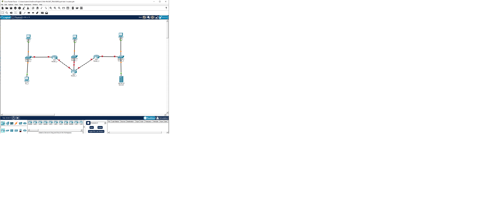
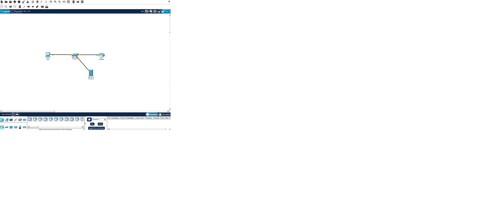
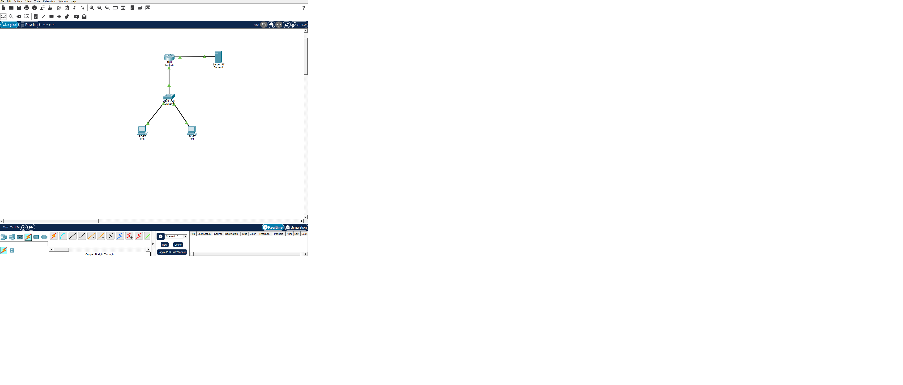

# IPv6 Lab — 3 Routers, Dual Serial Links

## Opis

Własne ćwiczenie adresacji IPv6, wykonane poza kursem CCNA, w oparciu
o zdobytą wiedzę z VLSM i adresacji IPv6.

## Topologia



- 3 routery (Router_1, Router_2, Router_3)
- Router_1 połączony łączem Serial z Router_2 oraz Router_3
- Każdy router ma własną sieć LAN (switch + komputery)

## Adresacja IPv6

Prefiks bazowy: `2001:db8:acad::/48`

| Segment                      | Podsieć              |
| ---------------------------- | -------------------- |
| Router_1 ↔ Router_2 (Serial) | 2001:db8:acad:4::/64 |
| Router_1 ↔ Router_3 (Serial) | 2001:db8:acad:5::/64 |
| LAN przy Router_2            | 2001:db8:acad:1::/64 |
| LAN przy Router_3            | 2001:db8:acad:3::/64 |

## Status

- [x] Połączenia Serial skonfigurowane i przetestowane (ping OK)
- [ ] Adresacja sieci LAN
- [ ] Routing między podsieciami

# DNS Lab — Basic DNS Resolution

## Opis

Proste ćwiczenie konfiguracji DNS w Cisco Packet Tracer, wykonane
na podstwie wiedzy z kursu CCNA.

Celem ćwiczenia jest skonfigurowanie serwera DNS, dodanie rekordów DNS
oraz sprawdzenie rozwiązywania nazw z poziomu komputera i routera.

## Topologia



- 1 router (R1)
- 1 switch (SW1)
- 1 komputer (PC1)
- 1 serwer pełniący funkcję DNS Server

## Adresacja IPv4

Sieć: `192.168.10.0/24`

| Urządzenie | Interfejs / rola | Adres IP       |
| ---------- | ---------------- | -------------- |
| R1         | Gateway          | 192.168.10.1   |
| PC1        | Host             | 192.168.10.10  |
| Server     | DNS Server       | 192.168.10.100 |

### DNS Records

| Nazwa              | Adres IP       |
| ------------------ | -------------- |
| `www.lab.local`    | 192.168.10.100 |
| `router.lab.local` | 192.168.10.1   |

## Konfiguracja DNS

Na serwerze włączono usługę DNS i skonfigurowano rekordy:

- `www.lab.local` → `192.168.10.100`
- `router.lab.local` → `192.168.10.1`

Na PC1 skonfigurowano adres DNS Server:

`192.168.10.100`

Na R1 skonfigurowano korzystanie z serwera DNS:

````cisco
ip name-server 192.168.10.100
ip domain-name lab.local
```Testy

Rozwiązywanie nazw zostało przetestowane z poziomu PC1:

ping www.lab.local
ping router.lab.local

Test router.lab.local zakończył się poprawnie:

Pinging 192.168.10.1 with 32 bytes of data:


Reply from 192.168.10.1: bytes=32 time<1ms TTL=255
Reply from 192.168.10.1: bytes=32 time=1ms TTL=255
Reply from 192.168.10.1: bytes=32 time=1ms TTL=255
Reply from 192.168.10.1: bytes=32 time<1ms TTL=255
````

# VLAN & Inter-VLAN Routing Lab

## Opis

Ćwiczenie konfiguracji VLAN, trunkingu oraz routingu między VLAN-ami
w Cisco Packet Tracer, wykonane na podstawie wiedzy z kursu CCNA.

Celem ćwiczenia było skonfigurowanie dwóch VLAN-ów, połączenia trunkowego
między switchem i routerem oraz router-on-a-stick umożliwiającego routing
między różnymi sieciami.

Dodatkowo skonfigurowano osobną sieć pomiędzy routerem i Serverem.

## Topologia



- 1 router (R1)
- 1 switch (SW1)
- 2 komputery (PC0, PC1)
- 1 serwer
- R1 G0/0 połączony z SW1 trunkem
- R1 G0/1 połączony bezpośrednio z Serverem

## VLAN

| VLAN | Nazwa   | Urządzenie | Port switcha |
| ---- | ------- | ---------- | ------------ |
| 10   | USERS   | PC0        | Fa0/2        |
| 20   | SERVERS | PC1        | Fa0/3        |

Połączenie SW1 Gi0/1 ↔ R1 G0/0 skonfigurowano jako trunk
802.1Q przenoszący ruch VLAN 10 i VLAN 20.

## Adresacja IPv4

### VLAN 10

Sieć: `192.168.10.0/24`

| Urządzenie | Interfejs / rola  | Adres IP      |
| ---------- | ----------------- | ------------- |
| R1         | G0/0.10 / Gateway | 192.168.10.1  |
| PC0        | Host              | 192.168.10.10 |

### VLAN 20

Sieć: `192.168.20.0/24`

| Urządzenie | Interfejs / rola  | Adres IP      |
| ---------- | ----------------- | ------------- |
| R1         | G0/0.20 / Gateway | 192.168.20.1  |
| PC1        | Host              | 192.168.20.10 |

### Sieć R1 ↔ Server

Sieć: `203.0.113.0/30`

| Urządzenie | Interfejs / rola | Adres IP    |
| ---------- | ---------------- | ----------- |
| R1         | G0/1 / Gateway   | 203.0.113.1 |
| Server     | Host             | 203.0.113.2 |

## Konfiguracja VLAN

Na SW1 utworzono dwa VLAN-y:

```cisco
vlan 10
 name USERS

vlan 20
 name SERVERS

 Port PC0 skonfigurowano jako access VLAN 10:

interface fa0/2
 switchport mode access
 switchport access vlan 10

Port PC1 skonfigurowano jako access VLAN 20:

interface fa0/3
 switchport mode access
 switchport access vlan 20

Konfiguracja trunku

Połączenie SW1 Gi0/1 ↔ R1 G0/0 skonfigurowano jako trunk:

interface gi0/1
 switchport mode trunk
Router-on-a-Stick

Na R1 skonfigurowano subinterfejsy dla poszczególnych VLAN-ów.

VLAN 10
interface gigabitEthernet 0/0.10
 encapsulation dot1Q 10
 ip address 192.168.10.1 255.255.255.0
VLAN 20
interface gigabitEthernet 0/0.20
 encapsulation dot1Q 20
 ip address 192.168.20.1 255.255.255.0

Subinterfejsy pełnią funkcję bram domyślnych dla odpowiednich VLAN-ów
i umożliwiają routing między sieciami.

Konfiguracja połączenia z Serverem

Interfejs R1 G0/1 skonfigurowano jako zwykły interfejs routowany,
bez VLAN-u i bez subinterfejsu:

interface gigabitEthernet 0/1
 ip address 203.0.113.1 255.255.255.252
 no shutdown

Na Serverze ustawiono:

IPv4: 203.0.113.2
Subnet Mask: 255.255.255.252
Default Gateway: 203.0.113.1
DHCP

PC0 i PC1 mają włączone DHCP.

Otrzymane adresy:

PC0
IPv4: 192.168.10.10
Subnet Mask: 255.255.255.0
Default Gateway: 192.168.10.1
DNS: 192.168.20.10
PC1
IPv4: 192.168.20.10
Subnet Mask: 255.255.255.0
Default Gateway: 192.168.20.1
DNS: 192.168.20.10

Testy

Do weryfikacji konfiguracji wykorzystano:

show vlan brief
show interfaces trunk
show ip interface brief

Sprawdzono również komunikację za pomocą ping.

Testy bram

PC0 → 192.168.10.1 — OK

PC1 → 192.168.20.1 — OK

Server → 203.0.113.1 — OK

Połączenia między urządzeniami zostały dodatkowo zweryfikowane
po zakończeniu konfiguracji.

Status
 VLAN 10 skonfigurowany
 VLAN 20 skonfigurowany
 Porty access skonfigurowane
 Trunk SW1 ↔ R1 skonfigurowany
 Router-on-a-Stick skonfigurowany
 Routing między VLAN-ami skonfigurowany
 Osobna sieć R1 ↔ Server skonfigurowana
 DHCP na PC0 i PC1 zweryfikowane
 Połączenia przetestowane za pomocą ping
 Podstawowy troubleshooting wykonany
```
